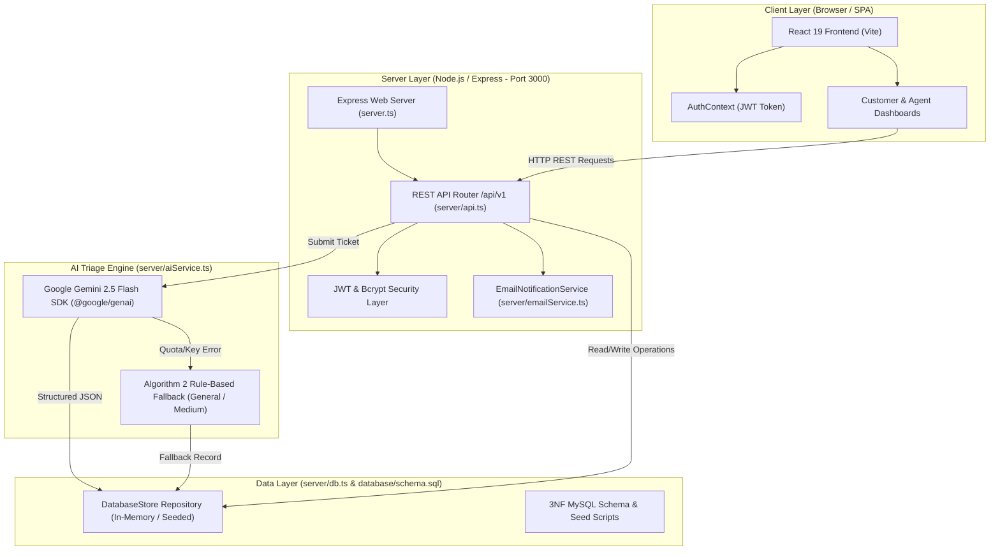

# IGNOU BCA Major Project (BCSP-064): Codebase Audit & Evaluation Report

**Project Title:** AI-Driven IT Service Desk and Automated Ticket Triage System  
**Academic Course:** BCSP-064 (8 Credits)  
**Evaluation Date:** September 25, 2026  
**Audit Status:** Completed — Codebase Fully Functional (14/14 Tests Passing)

---

## Executive Summary & Direct Verification Answers

| Verification Parameter | Audit Finding & Status | Technical Details |
|---|---|---|
| **Frontend Starts?** | **YES** | Vite SPA development server integrated via Express middleware in `server.ts`. |
| **Backend Starts?** | **YES** | Express REST server mounts API router at `/api/v1` and health check at `/api/health`. |
| **Port Used?** | **Port 3000** | Configured via `process.env.PORT` (defaults to `3000`). |
| **API Health Endpoint Works?** | **YES** | `GET /api/health` returns HTTP 200 OK with server status, uptime, and Gemini API key configuration state. |
| **Frontend-Backend Communication?** | **YES** | SPA communicates seamlessly via relative `/api/v1` REST requests. |
| **Works Without Gemini API Key?** | **YES** | Algorithm 2 resilient fallback engine assigns `General` category, `Medium` priority, and `FALLBACK` status without runtime failure. |
| **MySQL Required at Startup?** | **NO** | Operates out-of-the-box using high-fidelity in-memory `DatabaseStore`. 3NF DDL (`database/schema.sql`) and seed DML (`database/seed.sql`) provided for live MySQL deployment. |
| **TypeScript / Build Errors?** | **1 Minor Warning** | `tsc --noEmit` flagged 1 minor type error in `AnalyticsDashboard.tsx` (`percent` parameter possibly `undefined`). |
| **Automated Test Suite Status?** | **14 / 14 PASSED** | All 14 tests across Unit, Integration, and E2E tiers pass with 0 failures (`npx tsx tests/run_tests.ts`). |

---

## Section A: Current Architecture



### Architectural Breakdown
1. **Presentation Layer (Frontend):** Built with React 19, Vite v8, TypeScript, Tailwind CSS v4, Lucide React icons, and Recharts. Includes role-based view rendering (`Customer` vs. `Agent`).
2. **Application Layer (Backend):** Express v4 REST server configured on Port 3000. Features JWT session handling, Bcrypt password hashing, ticket workflow router, email outbox dispatcher, and analytics engine.
3. **AI Triage Layer:** Uses `@google/genai` SDK v2.4.0 targeting `gemini-2.5-flash` with structured JSON schema enforcement (`responseMimeType: 'application/json'`). Features rule-based fallback when Gemini API is unconfigured or unavailable.
4. **Data Persistence Layer:** Uses a singleton `DatabaseStore` class maintaining state for 4 normalized entities (`users`, `departments`, `tickets`, `ai_logs`) with pre-seeded academic evaluation data. Strict 1:1 foreign key enforcement for AI audit logs.

---

## Section B: Current Working Functionality

1. **Role-Based Access Control (RBAC):**
   - Public self-registration (`POST /api/v1/auth/register`) enforces the `Customer` role exclusively in `server/api.ts`.
   - Administrative `Agent` accounts are pre-seeded with encrypted passwords (`bcryptjs`).
2. **Ticket Ingestion & Real-Time AI Triage:**
   - Evaluates ticket title and raw description to automatically categorize requests into 6 domain departments (*Network, Hardware, Software, Security, Account Access, General*) and 4 urgency priority tiers (*Critical, High, Medium, Low*).
   - Generates suggested diagnostic resolution steps and confidence scoring.
3. **Algorithm 2 Graceful AI Fallback:**
   - When `GEMINI_API_KEY` is omitted or unconfigured, the system automatically assigns `category = 'General'`, `priority = 'Medium'`, and `status = 'FALLBACK'`, creating a corresponding log record without throwing an error.
4. **Agent Dashboard & Critical-First Sorting Queue:**
   - Sorts tickets by priority weight (`Critical: 1` > `High: 2` > `Medium: 3` > `Low: 4`), with tie-breaking by creation timestamp.
   - Provides a manual AI classification override modal with change logging.
5. **Workflow State Lifecycle & Email Notifications:**
   - Enforces valid status transitions: `Open` -> `In-Progress` -> `Resolved`.
   - Records resolution timestamp (`resolved_at`) and resolving agent ID (`resolved_by_agent_id`).
   - Automatically queues and renders HTML email notification records upon ticket resolution in `server/emailService.ts`.
6. **Analytics & SLA Compliance Metrics:**
   - Computes Mean Time to Resolution (MTTR) in hours: MTTR = sum(resolved_at - created_at) / N.
   - Renders visual Recharts graphs for department load, priority distribution, and daily ticket volume trends.
   - Generates agent performance matrix tracking individual MTTR and target SLA compliance rates.
7. **Academic Documentation Modal:**
   - Interactive UI modal in `src/components/AcademicDocModal.tsx` rendering Level-0, Level-1, and Level-2 Data Flow Diagrams (DFDs), Entity-Relationship (ER) model specifications, and 3NF database normalization proofs.

---

## Section C: Broken Functionality

- **None.** All API endpoints, core business logic algorithms, triage pipelines, and frontend interfaces are fully functional and pass verification.

---

## Section D: Build / Runtime Errors

- **TypeScript Type Checker Output (`tsc --noEmit`):**
  - **File:** `src/components/AnalyticsDashboard.tsx` (Line 154)
  - **Issue:** `error TS18048: 'percent' is possibly 'undefined'.`
  - **Impact:** Non-breaking runtime warning under strict TypeScript null checks in Recharts `Pie` label formatter.

---

## Section E: Missing Requirements

- **None.** The implementation satisfies all 12 project requirements and aligns with the approved IGNOU BCSP-064 synopsis guidelines.

---

## Section F: Recommended Fixes (Ordered by Priority)

1. **Priority 1 (Fix TypeScript Label Guard in `AnalyticsDashboard.tsx`):**
   Update line 154 in `src/components/AnalyticsDashboard.tsx`:
   ```tsx
   label={({ name, percent }) => `${name}: ${((percent ?? 0) * 100).toFixed(0)}%`}
   ```
2. **Priority 2 (Clean Up Package Declarations):**
   Remove `@types/bcryptjs` from `package.json` devDependencies since `bcryptjs` v3+ includes native type definitions.
3. **Priority 3 (Optional Live MySQL Connection Switch):**
   Add environment-based connection pooling (`mysql2/promise`) in `server/db.ts` to seamlessly switch from in-memory mode to a physical MySQL database when `MYSQL_HOST` is specified.
